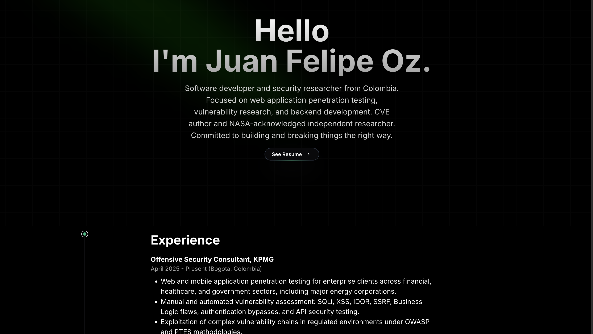

<div align="center">

# Juan Felipe Oz - Portfolio

**Security Researcher · Ethical Hacker · Software Developer**

[](https://juanfelipeoz.software/)
[](https://hackerone.com/jf0x0r)
[](https://bugcrowd.com/jf0x0r)
[](https://medium.com/@juanfelipeoz.rar)

---



</div>

---

## About

Personal portfolio of **Juan Felipe Osorio (jf0x0r)**, software developer and security researcher from Colombia. This site documents my work in vulnerability research, pentesting, bug bounty, certifications, and software development.

**Highlights:**
- 🛡️ Ethical Hacker at **KPMG Colombia** (April 2025 – Present)
- 🔬 Independent Researcher and Bug Hunter on **HackerOne**, **BugCrowd**
- 📜 **CVE author** — +6 published CVEs (Strawberry GraphQL, APTRS, Admidio, Heimdall, Nginx Proxy Manager)
- 🚀 Acknowledged by **NASA VDP** (2× Letters of Recognition)
- 🎓 **eWPTXv3** (INE Security) · **BSCP** (PortSwigger)

---

## Tech Stack

| Layer | Technologies |
|---|---|
| **Framework** | Next.js 14, React 18, TypeScript |
| **Styling** | Tailwind CSS, Framer Motion |
| **UI Components** | Aceternity UI |
| **Icons** | react-icons |
| **Deployment** | Vercel (Edge Network) |
| **Performance** | Next.js Image optimization, dynamic imports, edge-cached API routes |

---

## Sections

| Section | Description |
|---|---|
| **Hero** | Animated multilingual greeting with typing effect |
| **Experience** | KPMG · HackerOne/BugCrowd · Siesa internship |
| **CVEs / Research** | 6+ published CVEs with advisory links — horizontal scroll |
| **Achievements** | NASA VDP · Adobe HackerOne report · Bug bounty programs |
| **Certifications** | eWPTXv3 (INE) · BSCP (PortSwigger) |
| **Security Chronicles** | Dynamic Medium blog feed via edge-cached RSS API |
| **Projects** | TorIPGuard · H1Notifier · CryptoHack · GPU-Hunter |
| **Stack / Tools** | Offensive Security · Development · Platforms |

---

## Getting Started

```bash
# Install dependencies
npm install

# Run development server
npm run dev
```

Open [http://localhost:3000](http://localhost:3000) in your browser.

### Other scripts

```bash
npm run build      # Production build
npm run start      # Start production server
npm run lint       # ESLint check
npm run analyze    # Bundle analysis (opens visual bundle map)
```

---

## Performance Optimizations

- **Next.js `<Image>`** — automatic AVIF/WebP conversion + lazy loading on all images
- **`next/font`** with `display: swap` — eliminates layout shift from font loading
- **Dynamic imports** — below-fold components are code-split and loaded on demand
- **Edge-cached RSS route** — `/api/medium` caches the Medium feed for 1h at Vercel's edge (`s-maxage=3600, stale-while-revalidate=86400`)
- **Security headers** — `X-Content-Type-Options`, `X-Frame-Options`, `X-XSS-Protection` on all routes
- **Static asset caching** — `Cache-Control: public, max-age=31536000, immutable` on all images

---

## Project Structure

```
src/
├── app/
│   ├── api/medium/route.ts    # Edge-cached RSS API route
│   ├── layout.tsx             # Metadata, SEO, OpenGraph, fonts
│   └── page.tsx               # Root page with dynamic imports
└── components/
    ├── Hero.tsx               # Animated hero with typing effect
    ├── ExperienceInfo.tsx     # TracingBeam layout — all sections
    ├── MediumPosts.tsx        # Dynamic + static blog cards
    ├── ProjectsCards.tsx      # HoverEffect project grid
    ├── ContainerScrollDemo.tsx # Tech stack pills
    ├── Projects.tsx           # Sparkles section header
    ├── Footer.tsx             # Social links
    └── ScrollToTop.tsx        # Scroll utility
```

---

## CVEs Published

| CVE | Type | Target |
|---|---|---|
| [CVE-2026-35526](https://github.com/strawberry-graphql/strawberry/security/advisories/GHSA-hv3w-m4g2-5x77) | DoS | Strawberry GraphQL (>5M downloads/mo) |
| [CVE-2026-34406](https://github.com/APTRS/APTRS/security/advisories/GHSA-gv25-wp4h-9c35) | Privilege Escalation | APTRS |
| [CVE-2026-34381](https://github.com/Admidio/admidio/security/advisories/GHSA-7fh7-8xqm-3g88) | Broken Access Control | Admidio |
| [CVE-2026-34382](https://github.com/Admidio/admidio/security/advisories/GHSA-g3mx-8jm6-rc85) | CSRF | Admidio |
| [CVE-2025-50578](https://www.cve.org/CVERecord?id=CVE-2025-50578) | Host Header Injection | Heimdall (LinuxServer.io) |
| [CVE-2025-50579](https://nvd.nist.gov/vuln/detail/cve-2025-50579) | Auth Bypass | Nginx Proxy Manager v2.12.3 |

---

## Deployment

Deployed on **Vercel** with automatic CI/CD on push to `main`.

[](https://vercel.com/new/clone?repository-url=https://github.com/JFOZ1010/Portfolio-JF0x0r)

---

<div align="center">

Made with focus by **jf0x0r** · [juanfelipeoz.vercel.app](https://juanfelipeoz.vercel.app/)

</div>
